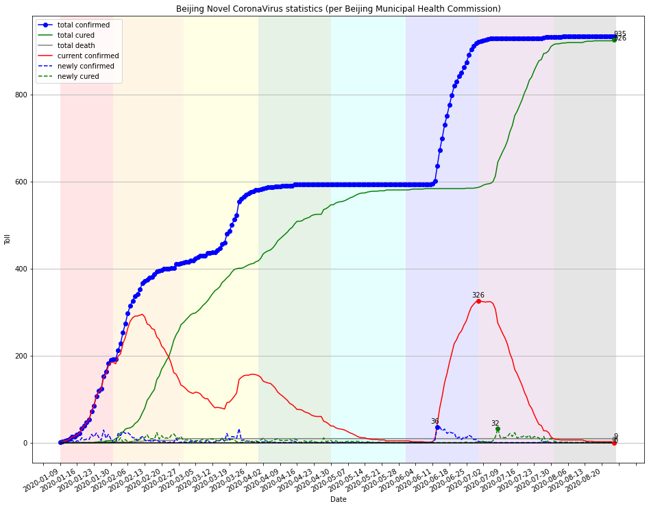

# covid19_beijing
The COVID-19 statistics  
in Beijing  
from 2020-01-09(first paroxysm) to 2020-08-25(case clear)  
as per *Beijing Municipal Health Commission*,  
including three outbreaks of the initial local, oversee import and the Xinfadi.

This is a matplotlib exercise demo.

The statistics were manually crawled considering the frequent change of report format.

Other interesting ariticles:
https://mp.weixin.qq.com/s/VoBN3mBRgpSuxsNr4c3wnQ
